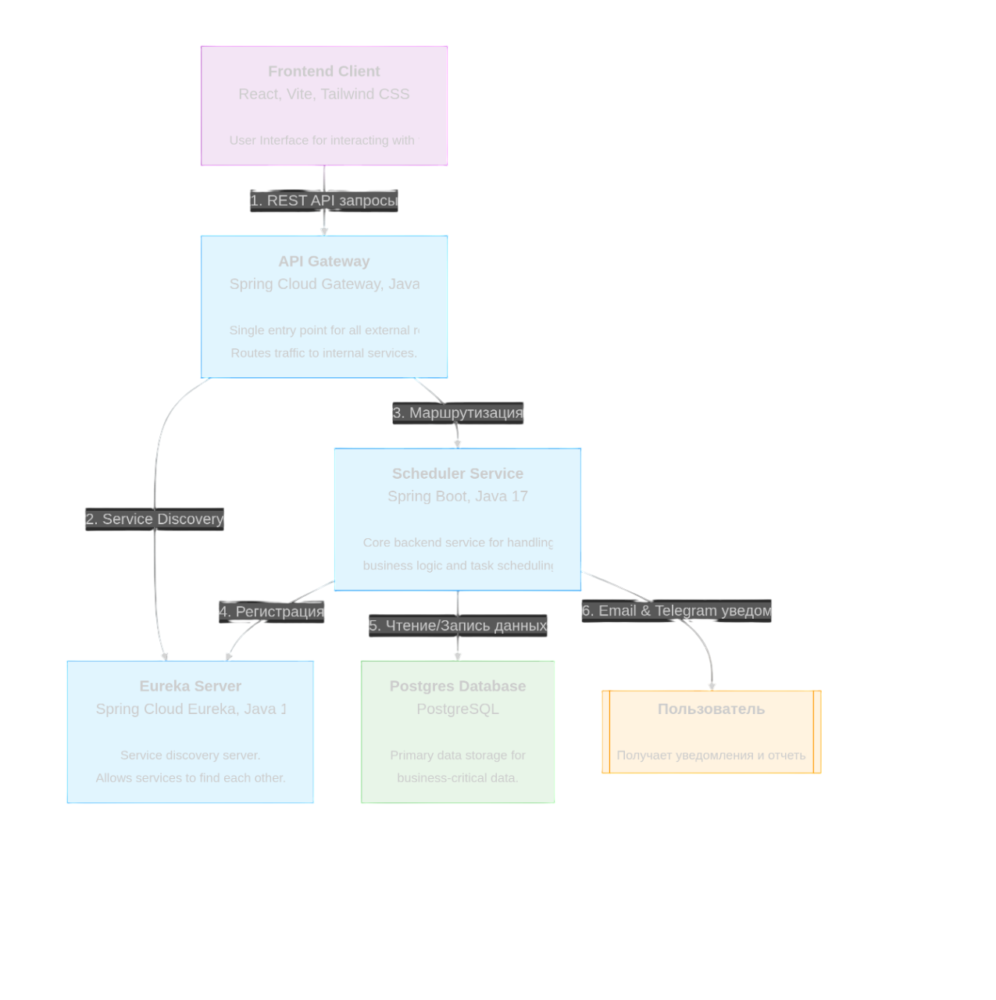

# BigBrother Ping - Система мониторинга и планирования

## Авторы
Бэкенд: Игорь Клюшников, оригинальный репозиторий: [BigBrotherBackendFinal](https://gitlab.com/reinar4747/bigbrotherbackendfinal.git)
Фронтенд: Василий Перяшкин, оригинальный репозиторий: [ping](https://github.com/Excited669/ping.git)
Капитан команды: Денис Зайцев

## О проекте
Проект "BigBrother Ping" представляет собой серверную инфраструктуру мониторинга доступности серверов и управления расписаниями задач. Система построена с применением микросервисной архитектуры и предназначена для централизованного контроля состояния удалённых серверов, уведомления пользователей о проблемах, а также автоматического планирования задач.

## Проблема
В крупной распределенной системе с множеством сервисов возникает проблема управления их взаимодействием и отслеживания их состояния. Отсутствие централизованного подхода приводит к сложностям в диагностике сбоев, масштабировании и поддержке.

## Решение
Мы предлагаем использовать микросервисную архитектуру, где каждый сервис выполняет одну конкретную функцию. В основе решения лежат следующие принципы:
**Сервисная независимость:** Сервисы работают автономно, что упрощает их разработку и развертывание.
**Централизованное управление:** Единый API Gateway и Service Discovery (Eureka) позволяют эффективно управлять трафиком и взаимодействием.
**Масштабируемость:** Каждый сервис может быть масштабирован независимо, чтобы справляться с возрастающей нагрузкой.

## Структура проекта
Проект разделен на две основные части: бэкенд и фронтенд, каждая со своей структурой.

### Структура папок бэкенда
```text
.
├── .idea/
├── .mvn/
├── api_gateway/
├── docker/
├── eureka_server/
├── postgres/
├── scheduler_service/
├── src/
├── target/
├── .gitignore
├── Dockerfile
├── docker-compose.yaml
├── pom.xml
└── README.md
```
**Описание папок верхнего уровня:**
- `.idea/`: Директория для служебных файлов IDE IntelliJ IDEA. Содержит конфигурацию проекта, настройки рабочей области и кэши.
- `.mvn/`: Содержит вспомогательные файлы для Maven Wrapper, которые позволяют запускать Maven-команды без предварительной установки Maven на локальной машине.
- `api_gateway/`: Содержит исходный код и конфигурацию сервиса API Gateway. Этот сервис является единой точкой входа для всех клиентских запросов.
- `docker/`: Директория для скриптов и файлов, связанных с Docker Compose. Используется для локальной разработки и развёртывания всей системы.
- `eureka_server/`: Директория с кодом сервиса Eureka Server, который отвечает за обнаружение и регистрацию микросервисов в архитектуре.
- `postgres/`: Содержит конфигурацию и скрипты для базы данных PostgreSQL, которая используется для хранения данных.
- `scheduler_service/`: Директория с исходным кодом, тестами и конфигурацией основного сервиса Scheduler Service. Этот сервис выполняет ключевые бизнес-функции: мониторинг и планирование задач.
- `src/`: Основная директория для исходного кода. Здесь находятся все Java-файлы и ресурсы приложения.
- `target/`: Автоматически генерируемая директория, содержащая скомпилированные классы и сборочные артефакты (например, .jar файлы).
- `.gitignore`: Файл, указывающий Git, какие файлы и папки нужно игнорировать и не включать в репозиторий.
- `Dockerfile`: Файл с инструкциями для сборки Docker-образа.
- `docker-compose.yaml`: YAML-файл, который описывает и оркестрирует все сервисы в Docker.
- `pom.xml`: Главный файл конфигурации проекта Apache Maven, который управляет зависимостями, плагинами и процессом сборки.
- `README.md`: Основной файл документации, описывающий проект, его функционал, архитектуру и инструкции по развёртыванию.

### Структура папок фронтенда
```text
.
├── .vscode/
├── dist/
├── node_modules/
├── public/
├── src/
├── .eslintrc.cjs
├── package.json
├── postcss.config.js
├── tailwind.config.js
├── tsconfig.json
├── vite.config.ts
└── (остальные файлы проекта)
```
**Описание папок верхнего уровня:**
- `.vscode/`: Конфигурация VSCode.
- `dist/`: Скомпилированные статические файлы (готовые к развертыванию).
- `node_modules/`: Установочные пакеты Node.js.
- `public/`: Статические ресурсы.
- `src/`: Исходный код React-приложения.
- `.eslintrc.cjs`: Конфигурация ESLint.
- `package.json`: Манифест проекта Node.js.
- `postcss.config.js`: Конфигурация PostCSS.
- `tailwind.config.js`: Конфигурация Tailwind CSS.
- `tsconfig.json`: Конфигурация TypeScript.
- `vite.config.ts`: Конфигурация сборщика Vite.

## Архитектурная схема

[](assets/project_architecture.png)

## Основные функции:
- **Мониторинг Доступности Серверов:** Автоматическое выполнение проверок доступности серверов.
- **Оповещения Пользователя:** Отправка уведомлений пользователям через Telegram и электронную почту.
- **Интуитивно понятный UI/UX:** Фронтенд-интерфейс, позволяющий легко взаимодействовать с системой.
- **Планировщик Заданий:** Поддержка возможности планировать отдельные задачи для отдельных серверов и пользователей.
- **Логирование и Отчеты:** Генерация журналов активности и формирование регулярных отчетов о состоянии серверов.

## Бизнес-ценность
* **Повышение надежности:** Отказоустойчивая архитектура минимизирует время простоя.
* **Ускорение разработки:** Независимые сервисы позволяют командам работать параллельно, сокращая цикл разработки и вывода новых функций на рынок.
* **Гибкость:** Простота добавления новых сервисов или замены существующих.

## Технологический стек
- **Бэкенд:** Java 17, Spring Boot, Spring Cloud (Eureka, Gateway), JPA/Hibernate, Liquibase, WebSocket, Apache Maven
- **Фронтенд:** React, Vite, Tailwind CSS, TypeScript
- **База данных:** PostgreSQL
- **Сборка и развертывание:** Docker, Docker Compose, Nginx
<br>Каждый компонент изолирован и запускается независимо.

## Метрики и измеримость эффекта
Без использования внешних систем мониторинга, эффективность системы может быть измерена с помощью следующих показателей:
* **Время доступности сервисов (Uptime):** Проверяется с помощью регулярных запросов к эндпоинтам `/actuator/health`. Измеряет надежность системы.
* **Количество ошибок в логах:** Регулярный анализ логов позволяет выявлять и устранять проблемы, что повышает стабильность системы.

## Инструкция по запуску
Для запуска всех компонентов системы вам понадобится установленный Docker и Docker Compose.

1.  **Склонируйте репозиторий проекта:**
    ```bash
    git clone [https://github.com/denis-42ds/big_brother_ping.git](https://github.com/denis-42ds/big_brother_ping.git)
    cd pingtower
    ```

2.  **Соберите и запустите все сервисы:**
    ```bash
    docker compose up --build
    ```
Это автоматически соберет и запустит все бэкенд-сервисы и фронтенд-приложение.

3.  **Доступ к приложению:**
- **Бэкенд:** Open Api будет доступен по адресу **`http://185.159.111.123:8080/swagger-ui/index.html`**
- **Фронтенд:**  Будет доступен по адресу **`http://185.159.111.123:80**
